ReadMe - ‚Is coding for me?‘:

# [LEARN CODING DECIDER](https://firstnamejonas.github.io/learn-coding-decider)

Welcome to Learn Coding Decider, a web application designed to help you answer the common question: "Is Coding for me?" 
The heart of the site is the Decider, an interactive decision tree that guides users through a series of questions to help them determine if pursuing programming as a future career path is the right choice. The ultimate goal is to encourage users to sign up for a newsletter, fostering a connection for ongoing guidance and support.

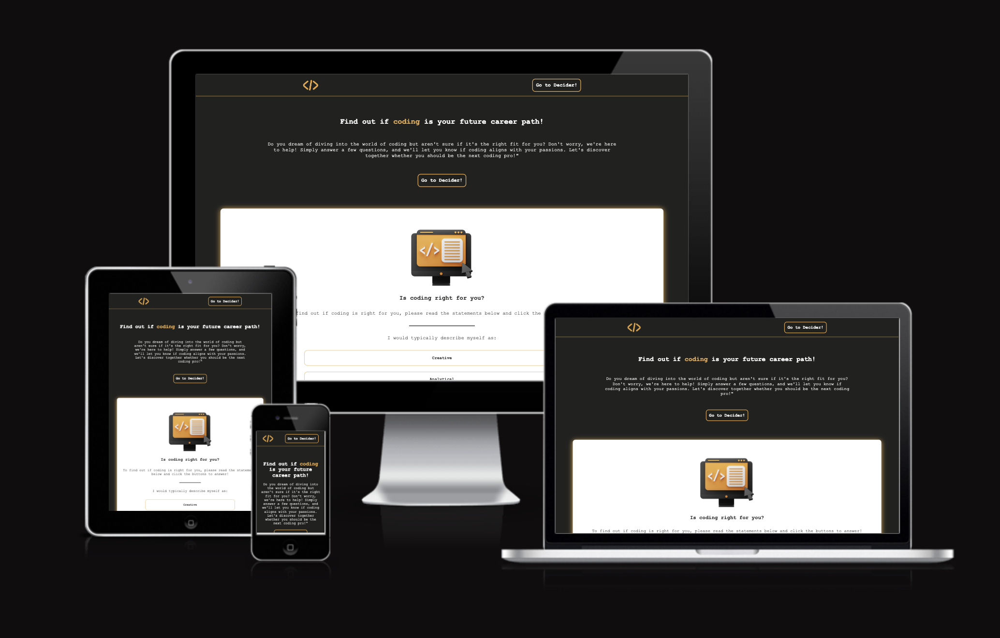

## UX

Crafting a compelling User Experience (UX) is pivotal in shaping and implementing the 'learn-coding-decider' website. Beyond merely disseminating information about the project, my objective is to establish an interactive and user-friendly environment that motivates visitors to actively engage with the initiative. The UX design process has been meticulously developed to enable seamless navigation, ensuring users comprehend the mission of 'Learn Coding Decider' and are ultimately inspired to find their right career path.
The process encompasses:
* Understanding the audience's informational needs and interests as the foundation for a strategically designed interface.
* Organizing the website structure for intuitive access to information, facilitating effortless navigation through its various sections.
* Designing a visually appealing layout that conveys key messages and the mission behind 'Learn Coding Decider' promptly.

### Colour Scheme

- #212120 and white are used for texts.
- #212120 is used for main background of the page
- #ebae4a is used for highlights of the page

I used these colors because they not only contrast well with each other, but also because they convey a technical flair. 

[coolors.co](https://coolors.co/212120-ebae4a-ffffff)

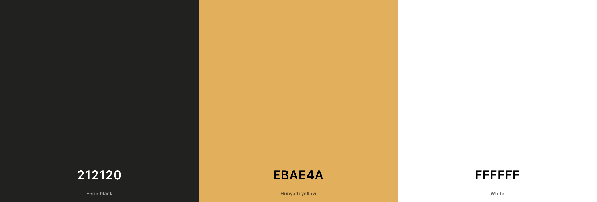

### Typography

- 'Courier New‘, with a backfall font of Courier and Monospace, was used for all text on the page.
- I used this font because it looks like the font you use in IDE's when programming.
- [Font Awesome](https://fontawesome.com) icons were used, such as the social media icons in the footer.

## User Stories

### New Site Users

- As a new site user, I would like to utilize the Decider so that I can determine if pursuing programming is a suitable career path for me.
- As a new site user, I would like to have clear guidance throughout the decision-making process so that I can navigate the Decider seamlessly.
- As a new site user, I would like to have the ability to reconsider my decision and restart the Decider so that I can learn more about my suitability for programming.

### Returning Site Users

- As a returning site user, I would like to show the Decider to my friends, enabling them to experience the Decider and discover their own coding potential.
- As a returning site user, I would like to subscribe to newsletters or updates so that I can stay informed about new developments in the programming field.

## Wireframes

To follow best practice, wireframes were developed for mobile, tablet, and desktop sizes.
I've used [Canva](https://www.canva.com) to design my site wireframes.

### Mobile Wireframes

 Click here to see the Mobile Wireframes 

Home Page
  - 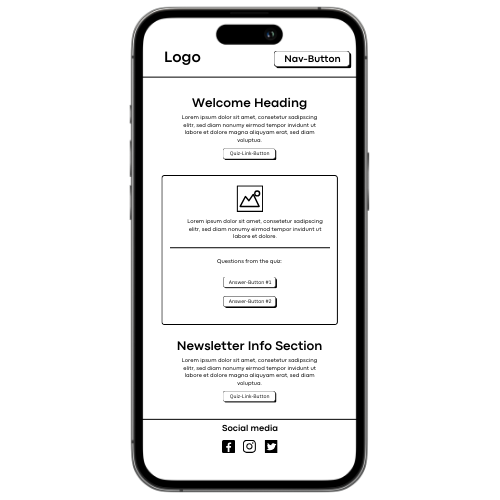

Confirmation Page
  - 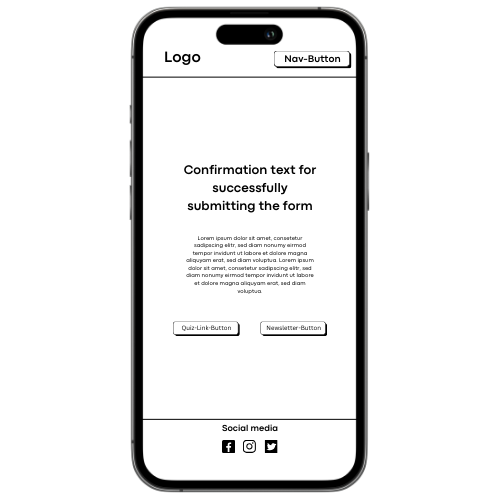

### Tablet Wireframes

 Click here to see the Tablet Wireframes 

Home Page
  - 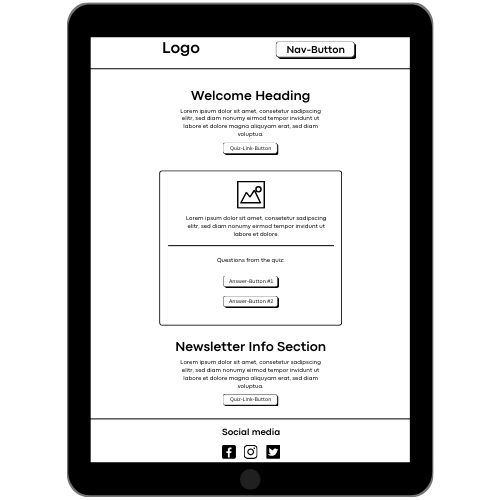

Confirmation Page
  - 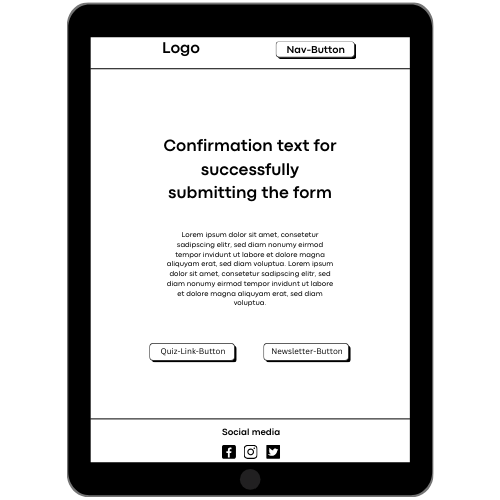

### Desktop Wireframes

 Click here to see the Desktop Wireframes 

Home Page
  - 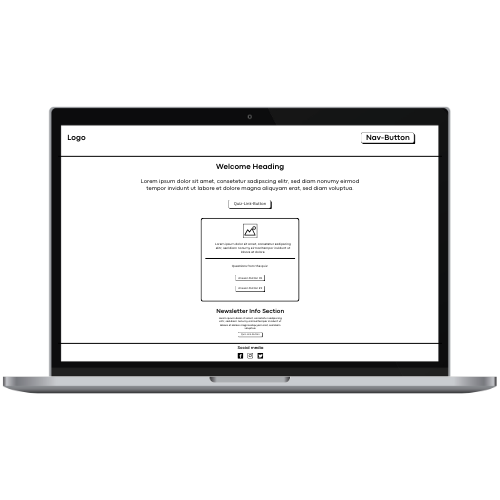

Confirmation Page
  - 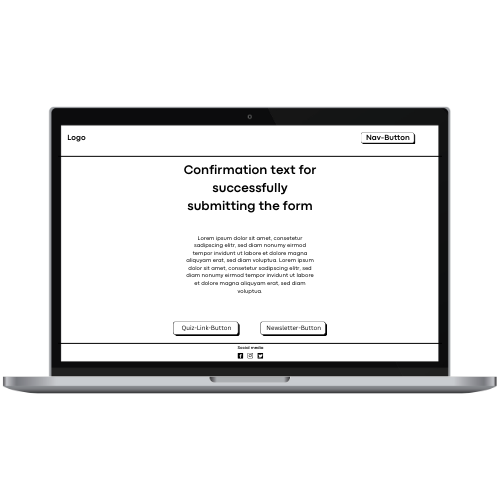

## Features

### Existing Features

- **Feature #1: Header**

- The header features a logo that serves as a home button, allowing users to easily navigate back to the homepage. 
- Additionally, there is a direct link to access the Decider tool, providing a seamless and intuitive user experience.

- **Feature #2: Hero-Section**

- The hero section provides essential information about the purpose and usage of the Decider tool. 
- Users can quickly understand how the Decider assists them in determining whether programming is a suitable career path. 
- The section also includes a prominent link to access the Decider tool for immediate engagement.

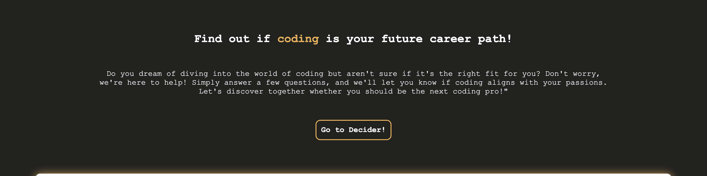

- **Feature #3: Decider - interactive decision tree**

- The Decider is a dynamic decision tree powered by JavaScript. 
- It presents users with a series of questions and guides them through a personalized journey. Based on their responses, the Decider determines whether programming is a fitting career choice. 
- If programming is recommended, users can proceed to an interactive form to subscribe to the newsletter. 
- In case programming is not recommended, a button allows users to reset the Decider for a fresh start.

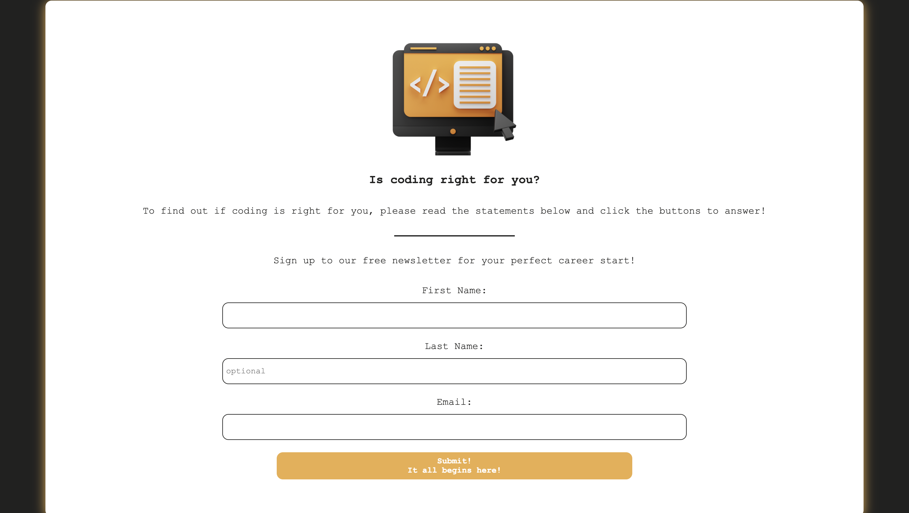
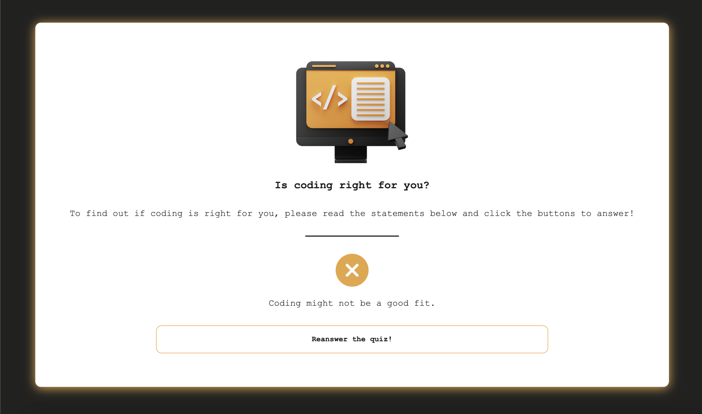

- **Feature #4: Newsletter Section - Subscription Information**

- This section provides users with details about the newsletter they can subscribe to. 
- It outlines the benefits of joining the newsletter, such as receiving updates, resources, and exclusive content related to programming and career paths.

- **Feature #5: Footer - Social Media Links and Copyright**

- The footer contains links to the website's social media profiles, facilitating user engagement and community interaction. 
- Additionally, it includes copyright information to convey ownership and protect intellectual property. 
- The footer ensures a professional and comprehensive conclusion to the website.

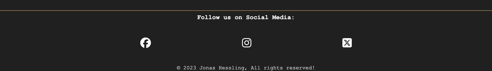

- **Feature #6: Confirmation Page Enhancements**

- Upon completing the form, users will be directed to a streamlined Confirmation Page for a seamless experience. After a brief 10-second countdown, users will automatically be redirected to the homepage, ensuring easy navigation.

- Key Additions:

- Quick Navigation: The automatic redirection to the homepage ensures users can swiftly explore additional content or revisit the Learn Coding Decider.

- Decider Replay: For those eager to reassess their coding journey, a prominent button will allow users to replay the Learn Coding Decider instantly.

- Newsletter Information: Another button will provide access to detailed information about the newsletter, allowing users to stay informed about updates and valuable insights.

- This enhanced Confirmation Page aims to balance efficiency with engagement, offering users the flexibility to continue their exploration or revisit key components of the Learn Coding Decider journey.

### Future Features

- **Future Feature: Sharing is caring**

- In the future, there could be an update that allows users to share their results on social media or with their friends.

## Tools & Technologies Used

- [HTML](https://en.wikipedia.org/wiki/HTML) used for the main site content.
- [CSS](https://en.wikipedia.org/wiki/CSS) used for the main site design and layout.
- [CSS Flexbox](https://www.w3schools.com/css/css3_flexbox.asp) used for an enhanced responsive layout.
- [JavaScript](https://www.javascript.com) used for user interaction on the site.
- [Git](https://git-scm.com) used for version control. (`git add`, `git commit`, `git push`)
- [GitHub](https://github.com) used for secure online code storage.
- [GitHub Pages](https://pages.github.com) used for hosting the deployed front-end site.
- [Gitpod](https://gitpod.io) used as a cloud-based IDE for development.

## Testing

For all testing, please refer to the [TESTING.md](TESTING.md) file.

## Deployment

The site was deployed to GitHub Pages. The steps to deploy are as follows:

- In the [GitHub repository](https://github.com/firstnamejonas/learn-coding-decider), navigate to the Settings tab 
- From the source section drop-down menu, select the **Main** Branch, then click "Save".
- The page will be automatically refreshed with a detailed ribbon display to indicate the successful deployment.

The live link can be found [here](https://firstnamejonas.github.io/learn-coding-decider)

### Local Deployment

This project can be cloned or forked in order to make a local copy on your own system.

#### Cloning

You can clone the repository by following these steps:

1. Go to the [GitHub repository](https://github.com/firstnamejonas/learn-coding-decider) 
2. Locate the Code button above the list of files and click it 
3. Select if you prefer to clone using HTTPS, SSH, or GitHub CLI and click the copy button to copy the URL to your clipboard
4. Open Git Bash or Terminal
5. Change the current working directory to the one where you want the cloned directory
6. In your IDE Terminal, type the following command to clone my repository:
	- `git clone https://github.com/firstnamejonas/learn-coding-decider.git`
7. Press Enter to create your local clone.

Alternatively, if using Gitpod, you can click below to create your own workspace using this repository.

Please note that in order to directly open the project in Gitpod, you need to have the browser extension installed.
A tutorial on how to do that can be found [here](https://www.gitpod.io/docs/configure/user-settings/browser-extension).

#### Forking

By forking the GitHub Repository, we make a copy of the original repository on our GitHub account to view and/or make changes without affecting the original owner's repository.
You can fork this repository by using the following steps:

1. Log in to GitHub and locate the [GitHub Repository](https://github.com/firstnamejonas/learn-coding-decider)
2. At the top of the Repository (not top of page) just above the "Settings" Button on the menu, locate the "Fork" Button.
3. Once clicked, you should now have a copy of the original repository in your own GitHub account!

### Local VS Deployment

There were no differences found.

## Credits

### Content

| Source | Location | Notes |
| --- | --- | --- |
| [Markdown Builder](https://tim.2bn.dev/markdown-builder) | README and TESTING | tool to help generate the Markdown files |
| [W3Schools](https://www.w3schools.com/howto/tryit.asp?filename=tryhow_css_buttons_fade3) | CSS file | Fading Buttons - "Fade in Effect" |
| [StackOverflow](https://stackoverflow.com/questions/8685107/hiding-a-button-in-javascript) | JavaScript file | used to hide and show elements at the right time in the decider container |
| [The Morpheus Tutorials](https://www.youtube.com/@TheMorpheusTutorials) & [CodeInstitute](https://learn.codeinstitute.net/courses/course-v1:CodeInstitute+LMR101+2021_T1/courseware/73e9c0413ead4a21b389e33c77706102/ba023cfa11c04351a3758b21ee4418fe/?child=first) & [CodeInstitute](https://learn.codeinstitute.net/courses/course-v1:CodeInstitute+LMR101+2021_T1/courseware/73e9c0413ead4a21b389e33c77706102/ba023cfa11c04351a3758b21ee4418fe/?child=first) | JavaScript file | used for tipps with switch cases and ternary operators |

### Media

| Source | Location | Type | Notes |
| --- | --- | --- | --- |
| [Canva](https://www.canva.com) | entire site | image | favicon on all pages |
| [Canva](https://www.canva.com) | entire site | image | logo on all pages |
| [Canva](https://www.canva.com) | decider container | image | animated desktop image |
| [Canva](https://www.canva.com) | decider container | image | fail sign when coding may not be right for user |
| [Canva](https://www.canva.com) | decider container | image | success sign when coding may be right for user |

### Acknowledgements

- I would like to thank my family & my partner Caro, for believing in me, and allowing me to make this transition into software development.
- I would like to thank my Code Institute mentor, Julia for her support throughout the development of this project, giving me confidence and valuable advice!
- I would like to thank my Code Institute mentor, [Tim Nelson](https://github.com/TravelTimN) for his ongoing support through out the project!
- I would like to thank the [Code Institute Slack community](https://code-institute-room.slack.com) for the moral support; it kept me going.